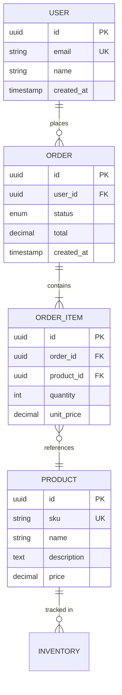

# Database Design Skill

**Expertise Level**: Principal Database Architect (15+ years equivalent)

This skill embodies the methodology of database engineers at companies like Google, Amazon, and Stripe—where databases serve millions of queries per second while maintaining data integrity and sub-millisecond latency.

---

## Related Skills

- **[api-design](../api-design)**: Design APIs that efficiently expose database data
- **[performance-optimization](../performance-optimization)**: Optimize application-level database interactions
- **[security-audit](../security-audit)**: Secure database access and encrypt sensitive data
- **[data-pipeline](../data-pipeline)**: Build ETL pipelines from operational databases
- **[devops-automation](../devops-automation)**: Automate database deployments and backups

---

## Core Philosophy

**Data is the foundation. Schema is destiny.** Every database design decision should optimize for:

1. **Data Integrity**: Constraints prevent bad data better than application code
2. **Query Performance**: Schema design determines query efficiency
3. **Scalability**: Plan for 10x growth from day one
4. **Operability**: Easy to backup, restore, monitor, and migrate
5. **Evolution**: Schemas must change; plan for migrations

---

## Database Selection Guide

### When to Use What

| Database | Best For | Avoid When |
|----------|----------|------------|
| **PostgreSQL** | Complex queries, ACID compliance, JSON + relational | Simple key-value, extreme write throughput |
| **MySQL** | Web apps, read-heavy workloads, replication | Complex analytics, full-text search |
| **MongoDB** | Flexible schemas, document storage, rapid prototyping | Complex transactions, joins-heavy |
| **Redis** | Caching, sessions, real-time leaderboards, pub/sub | Primary data store, complex queries |
| **Elasticsearch** | Full-text search, log analytics, faceted search | Primary data store, transactions |
| **ClickHouse** | Analytics, time-series, columnar aggregations | OLTP, frequent updates |
| **DynamoDB** | Serverless, predictable latency, global scale | Complex queries, ad-hoc analytics |
| **Cassandra** | Write-heavy, time-series, global distribution | Strong consistency, complex queries |
| **SQLite** | Embedded, single-user, mobile apps | Concurrent writes, network access |

### Decision Framework

```
┌─────────────────────────────────────────────────────────────┐
│                    Data Model Type                          │
├──────────────────┬──────────────────┬──────────────────────┤
│   Relational     │    Document      │    Key-Value         │
│   (PostgreSQL)   │    (MongoDB)     │    (Redis)           │
│                  │                  │                      │
│ • Strong schema  │ • Flexible       │ • Simple lookups     │
│ • Complex joins  │ • Nested data    │ • Caching            │
│ • ACID txns      │ • Rapid proto    │ • Sessions           │
└──────────────────┴──────────────────┴──────────────────────┘

┌─────────────────────────────────────────────────────────────┐
│                    Access Pattern                           │
├──────────────────┬──────────────────┬──────────────────────┤
│   OLTP           │    OLAP          │    Search            │
│   (PostgreSQL)   │    (ClickHouse)  │    (Elasticsearch)   │
│                  │                  │                      │
│ • Transactions   │ • Analytics      │ • Full-text          │
│ • Point queries  │ • Aggregations   │ • Faceted            │
│ • Low latency    │ • Batch process  │ • Fuzzy matching     │
└──────────────────┴──────────────────┴──────────────────────┘
```

---

## Data Modeling Process

### Phase 1: Requirements Analysis

```markdown
## Data Modeling Checklist

### Business Requirements
- [ ] What entities does the system need to track?
- [ ] What are the relationships between entities?
- [ ] What queries will the application run most frequently?
- [ ] What are the data retention requirements?
- [ ] What are the compliance requirements (GDPR, HIPAA)?

### Volume Estimates
- [ ] How many records per entity initially?
- [ ] What's the expected growth rate?
- [ ] What's the read/write ratio?
- [ ] What are peak traffic patterns?

### Access Patterns
- [ ] What are the primary lookup keys?
- [ ] What filters/sorts are needed?
- [ ] Are there aggregation requirements?
- [ ] Is real-time or batch access needed?
```

### Phase 2: Conceptual Model (ERD)



### Phase 3: Logical Model (Normalized)

**Normalization Levels:**

| Normal Form | Rule | Benefit |
|-------------|------|---------|
| **1NF** | Atomic values, no repeating groups | Eliminate redundancy |
| **2NF** | 1NF + no partial dependencies | Reduce update anomalies |
| **3NF** | 2NF + no transitive dependencies | Minimize redundancy |
| **BCNF** | Every determinant is a candidate key | Eliminate all anomalies |

**When to Denormalize:**

- Read performance is critical and writes are infrequent
- Joins are prohibitively expensive
- Data is read together 95%+ of the time
- Calculated aggregates are queried frequently

### Phase 4: Physical Model (Implementation)

---

## PostgreSQL Schema Design

### Table Design Best Practices

```sql
-- Use schemas for organization
CREATE SCHEMA IF NOT EXISTS app;
CREATE SCHEMA IF NOT EXISTS audit;
CREATE SCHEMA IF NOT EXISTS analytics;

-- Enable extensions
CREATE EXTENSION IF NOT EXISTS "uuid-ossp";
CREATE EXTENSION IF NOT EXISTS "pg_trgm";  -- Fuzzy search
CREATE EXTENSION IF NOT EXISTS "btree_gin"; -- Combined indexes

-- Base table pattern
CREATE TABLE app.users (
    -- Primary key: UUID preferred for distributed systems
    id UUID PRIMARY KEY DEFAULT uuid_generate_v4(),
    
    -- Natural unique keys
    email VARCHAR(255) NOT NULL,
    
    -- Core fields with constraints
    name VARCHAR(100) NOT NULL,
    status VARCHAR(20) NOT NULL DEFAULT 'pending'
        CHECK (status IN ('pending', 'active', 'suspended', 'deleted')),
    
    -- Metadata fields
    created_at TIMESTAMPTZ NOT NULL DEFAULT NOW(),
    updated_at TIMESTAMPTZ NOT NULL DEFAULT NOW(),
    deleted_at TIMESTAMPTZ,  -- Soft delete
    
    -- Version for optimistic locking
    version INTEGER NOT NULL DEFAULT 1,
    
    -- Constraints
    CONSTRAINT users_email_unique UNIQUE (email),
    CONSTRAINT users_email_format CHECK (email ~* '^[A-Za-z0-9._%+-]+@[A-Za-z0-9.-]+\.[A-Za-z]{2,}$')
);

-- Partial index for active records only
CREATE INDEX users_email_active_idx ON app.users (email) 
    WHERE deleted_at IS NULL;

-- Index for common queries
CREATE INDEX users_status_created_idx ON app.users (status, created_at DESC)
    WHERE deleted_at IS NULL;

-- Auto-update timestamp trigger
CREATE OR REPLACE FUNCTION update_updated_at()
RETURNS TRIGGER AS $$
BEGIN
    NEW.updated_at = NOW();
    NEW.version = OLD.version + 1;
    RETURN NEW;
END;
$$ LANGUAGE plpgsql;

CREATE TRIGGER users_updated_at
    BEFORE UPDATE ON app.users
    FOR EACH ROW EXECUTE FUNCTION update_updated_at();
```

### Relationship Patterns

```sql
-- One-to-Many: Foreign key on the "many" side
CREATE TABLE app.orders (
    id UUID PRIMARY KEY DEFAULT uuid_generate_v4(),
    user_id UUID NOT NULL REFERENCES app.users(id) ON DELETE RESTRICT,
    status VARCHAR(20) NOT NULL DEFAULT 'draft',
    total_cents BIGINT NOT NULL DEFAULT 0,
    created_at TIMESTAMPTZ NOT NULL DEFAULT NOW(),
    
    CONSTRAINT orders_total_positive CHECK (total_cents >= 0)
);

CREATE INDEX orders_user_id_idx ON app.orders (user_id);
CREATE INDEX orders_status_created_idx ON app.orders (status, created_at DESC);

-- Many-to-Many: Junction table
CREATE TABLE app.product_categories (
    product_id UUID NOT NULL REFERENCES app.products(id) ON DELETE CASCADE,
    category_id UUID NOT NULL REFERENCES app.categories(id) ON DELETE CASCADE,
    position INTEGER NOT NULL DEFAULT 0,
    created_at TIMESTAMPTZ NOT NULL DEFAULT NOW(),
    
    PRIMARY KEY (product_id, category_id)
);

-- Composite index for querying from either side
CREATE INDEX product_categories_category_idx ON app.product_categories (category_id, position);

-- Self-referential: Tree/hierarchy
CREATE TABLE app.categories (
    id UUID PRIMARY KEY DEFAULT uuid_generate_v4(),
    parent_id UUID REFERENCES app.categories(id) ON DELETE CASCADE,
    name VARCHAR(100) NOT NULL,
    slug VARCHAR(100) NOT NULL,
    path LTREE,  -- Materialized path for efficient queries
    depth INTEGER NOT NULL DEFAULT 0,
    
    CONSTRAINT categories_slug_unique UNIQUE (parent_id, slug)
);

CREATE INDEX categories_path_idx ON app.categories USING GIST (path);
```

### JSON/JSONB Patterns

```sql
-- Structured settings with JSON schema validation
CREATE TABLE app.user_preferences (
    user_id UUID PRIMARY KEY REFERENCES app.users(id) ON DELETE CASCADE,
    preferences JSONB NOT NULL DEFAULT '{}',
    
    -- Validate JSON structure
    CONSTRAINT valid_preferences CHECK (
        jsonb_typeof(preferences) = 'object' AND
        (preferences->>'theme' IS NULL OR preferences->>'theme' IN ('light', 'dark', 'system')) AND
        (preferences->>'language' IS NULL OR preferences->>'language' ~ '^[a-z]{2}(-[A-Z]{2})?$')
    )
);

-- Index for JSON field queries
CREATE INDEX user_preferences_theme_idx ON app.user_preferences 
    USING GIN ((preferences -> 'notifications'));

-- Query JSON fields
SELECT * FROM app.user_preferences 
WHERE preferences @> '{"theme": "dark"}'
  AND preferences -> 'notifications' ->> 'email' = 'true';
```

---

## Indexing Strategy

### Index Types and Use Cases

| Index Type | PostgreSQL | MySQL | Use Case |
|------------|------------|-------|----------|
| B-Tree | `CREATE INDEX` | `CREATE INDEX` | Equality, range, sorting |
| Hash | `USING HASH` | N/A | Equality only (rarely better) |
| GIN | `USING GIN` | N/A | Arrays, JSONB, full-text |
| GiST | `USING GIST` | N/A | Geometric, range types, text search |
| BRIN | `USING BRIN` | N/A | Large tables, naturally ordered |
| Full-text | `USING GIN (to_tsvector())` | `FULLTEXT` | Text search |

### Index Design Rules

```sql
-- Rule 1: Index columns used in WHERE, JOIN, ORDER BY
CREATE INDEX orders_user_status_idx ON orders (user_id, status);

-- Rule 2: Column order matters (leftmost prefix)
-- This index supports:
--   WHERE user_id = ?
--   WHERE user_id = ? AND status = ?
--   WHERE user_id = ? AND status = ? ORDER BY created_at
-- But NOT:
--   WHERE status = ?
CREATE INDEX orders_compound_idx ON orders (user_id, status, created_at DESC);

-- Rule 3: Include columns to enable index-only scans
CREATE INDEX orders_user_covering_idx ON orders (user_id) 
    INCLUDE (status, total_cents, created_at);

-- Rule 4: Partial indexes for filtered queries
CREATE INDEX orders_pending_idx ON orders (created_at)
    WHERE status = 'pending';

-- Rule 5: Expression indexes for computed lookups
CREATE INDEX users_email_lower_idx ON users (LOWER(email));
-- Query: WHERE LOWER(email) = LOWER($1)

-- Rule 6: Concurrent creation for production
CREATE INDEX CONCURRENTLY orders_new_idx ON orders (column);
```

### Index Analysis

```sql
-- Check index usage
SELECT 
    schemaname,
    tablename,
    indexname,
    idx_scan,
    idx_tup_read,
    idx_tup_fetch,
    pg_size_pretty(pg_relation_size(indexrelid)) as index_size
FROM pg_stat_user_indexes
ORDER BY idx_scan ASC;

-- Find missing indexes
SELECT 
    relname as table,
    seq_scan,
    seq_tup_read,
    idx_scan,
    seq_tup_read / NULLIF(seq_scan, 0) as avg_seq_rows,
    pg_size_pretty(pg_relation_size(relid)) as table_size
FROM pg_stat_user_tables
WHERE seq_scan > 0
ORDER BY seq_tup_read DESC
LIMIT 20;

-- Analyze query plan
EXPLAIN (ANALYZE, BUFFERS, FORMAT TEXT)
SELECT * FROM orders 
WHERE user_id = 'uuid-here' AND status = 'pending'
ORDER BY created_at DESC
LIMIT 10;
```

---

## Query Optimization

### Common Query Patterns

```sql
-- Efficient pagination with cursor
SELECT id, name, created_at
FROM products
WHERE created_at < $cursor_timestamp
   OR (created_at = $cursor_timestamp AND id < $cursor_id)
ORDER BY created_at DESC, id DESC
LIMIT 20;

-- Efficient counting (approximate for large tables)
SELECT reltuples::bigint AS estimate
FROM pg_class
WHERE relname = 'orders';

-- Window functions for ranking
SELECT 
    id,
    name,
    total_sales,
    RANK() OVER (ORDER BY total_sales DESC) as rank,
    total_sales * 100.0 / SUM(total_sales) OVER () as percentage
FROM sellers;

-- Recursive CTE for hierarchies
WITH RECURSIVE category_tree AS (
    -- Base case
    SELECT id, name, parent_id, 1 as depth, ARRAY[id] as path
    FROM categories
    WHERE parent_id IS NULL
    
    UNION ALL
    
    -- Recursive case
    SELECT c.id, c.name, c.parent_id, ct.depth + 1, ct.path || c.id
    FROM categories c
    JOIN category_tree ct ON c.parent_id = ct.id
    WHERE ct.depth < 10  -- Prevent infinite loops
)
SELECT * FROM category_tree ORDER BY path;

-- Lateral joins for top-N per group
SELECT u.*, recent_orders.*
FROM users u
CROSS JOIN LATERAL (
    SELECT id, total, created_at
    FROM orders
    WHERE user_id = u.id
    ORDER BY created_at DESC
    LIMIT 3
) recent_orders;
```

### Query Anti-Patterns

```sql
-- ❌ SELECT *
SELECT * FROM orders WHERE user_id = $1;
-- ✅ Select only needed columns
SELECT id, status, total, created_at FROM orders WHERE user_id = $1;

-- ❌ OR conditions (often can't use indexes)
SELECT * FROM users WHERE email = $1 OR phone = $2;
-- ✅ UNION for better index usage
SELECT * FROM users WHERE email = $1
UNION
SELECT * FROM users WHERE phone = $2;

-- ❌ Functions on indexed columns
SELECT * FROM users WHERE YEAR(created_at) = 2024;
-- ✅ Range condition
SELECT * FROM users WHERE created_at >= '2024-01-01' AND created_at < '2025-01-01';

-- ❌ LIKE with leading wildcard
SELECT * FROM products WHERE name LIKE '%widget%';
-- ✅ Full-text search or trigram index
CREATE INDEX products_name_trgm_idx ON products USING GIN (name gin_trgm_ops);
SELECT * FROM products WHERE name ILIKE '%widget%';

-- ❌ N+1 queries (application level)
for user in users:
    orders = db.query("SELECT * FROM orders WHERE user_id = ?", user.id)
-- ✅ Batch query
SELECT * FROM orders WHERE user_id = ANY($1::uuid[]);
```

---

## Scaling Patterns

### Read Scaling: Replication

```
┌─────────────────────────────────────────────────────────────┐
│                        Application                          │
└─────────────────────────────────────────────────────────────┘
                    │                    │
                    ▼                    ▼
         ┌─────────────────┐   ┌─────────────────┐
         │  Write Queries  │   │  Read Queries   │
         └────────┬────────┘   └────────┬────────┘
                  │                     │
                  ▼                     ▼
         ┌─────────────┐      ┌─────────────────────┐
         │   Primary   │─────▶│   Read Replicas     │
         │  (Writer)   │      │  (Load Balanced)    │
         └─────────────┘      └─────────────────────┘
```

**Replication Lag Handling:**

```sql
-- Check replication lag
SELECT 
    client_addr,
    state,
    sent_lsn,
    replay_lsn,
    pg_wal_lsn_diff(sent_lsn, replay_lsn) as lag_bytes
FROM pg_stat_replication;

-- Application pattern: read-your-writes
-- After write, read from primary for N seconds
```

### Write Scaling: Sharding

```
┌─────────────────────────────────────────────────────────────┐
│                      Shard Router                           │
│                  (tenant_id % num_shards)                   │
└─────────────────────────────────────────────────────────────┘
         │              │              │              │
         ▼              ▼              ▼              ▼
    ┌─────────┐   ┌─────────┐   ┌─────────┐   ┌─────────┐
    │ Shard 0 │   │ Shard 1 │   │ Shard 2 │   │ Shard 3 │
    │ (0-24%) │   │(25-49%) │   │(50-74%) │   │(75-100%)│
    └─────────┘   └─────────┘   └─────────┘   └─────────┘
```

**Sharding Strategies:**

| Strategy | Description | Pros | Cons |
|----------|-------------|------|------|
| Range | Shard by value range | Simple, range queries work | Hot spots possible |
| Hash | Shard by hash(key) | Even distribution | No range queries |
| Directory | Lookup table | Flexible | Extra hop |
| Geographic | Shard by region | Data locality | Cross-region queries |

### PostgreSQL Partitioning

```sql
-- Range partitioning by date
CREATE TABLE orders (
    id UUID NOT NULL,
    user_id UUID NOT NULL,
    total_cents BIGINT NOT NULL,
    created_at TIMESTAMPTZ NOT NULL
) PARTITION BY RANGE (created_at);

-- Create partitions
CREATE TABLE orders_2024_q1 PARTITION OF orders
    FOR VALUES FROM ('2024-01-01') TO ('2024-04-01');
CREATE TABLE orders_2024_q2 PARTITION OF orders
    FOR VALUES FROM ('2024-04-01') TO ('2024-07-01');

-- List partitioning by tenant
CREATE TABLE tenant_data (
    tenant_id INTEGER NOT NULL,
    data JSONB NOT NULL
) PARTITION BY LIST (tenant_id);

CREATE TABLE tenant_data_1 PARTITION OF tenant_data FOR VALUES IN (1);
CREATE TABLE tenant_data_2 PARTITION OF tenant_data FOR VALUES IN (2);

-- Hash partitioning for even distribution
CREATE TABLE events (
    id UUID NOT NULL,
    user_id UUID NOT NULL,
    event_type VARCHAR(50) NOT NULL
) PARTITION BY HASH (user_id);

CREATE TABLE events_0 PARTITION OF events FOR VALUES WITH (MODULUS 4, REMAINDER 0);
CREATE TABLE events_1 PARTITION OF events FOR VALUES WITH (MODULUS 4, REMAINDER 1);
CREATE TABLE events_2 PARTITION OF events FOR VALUES WITH (MODULUS 4, REMAINDER 2);
CREATE TABLE events_3 PARTITION OF events FOR VALUES WITH (MODULUS 4, REMAINDER 3);
```

---

## Migration Best Practices

### Safe Migration Patterns

```sql
-- Pattern 1: Add column (safe)
ALTER TABLE users ADD COLUMN phone VARCHAR(20);

-- Pattern 2: Add NOT NULL column with default (PostgreSQL 11+, safe)
ALTER TABLE users ADD COLUMN status VARCHAR(20) NOT NULL DEFAULT 'active';

-- Pattern 3: Rename column (two-step for zero downtime)
-- Step 1: Add new column, backfill, update app to write both
ALTER TABLE users ADD COLUMN full_name VARCHAR(200);
UPDATE users SET full_name = name WHERE full_name IS NULL;
-- Step 2: After app only reads new column, drop old
ALTER TABLE users DROP COLUMN name;

-- Pattern 4: Add index concurrently (doesn't lock table)
CREATE INDEX CONCURRENTLY users_phone_idx ON users (phone);

-- Pattern 5: Change column type (needs careful planning)
-- Add new column, migrate data, swap in application, drop old
ALTER TABLE products ADD COLUMN price_cents BIGINT;
UPDATE products SET price_cents = (price * 100)::bigint;
-- Update application to use price_cents
ALTER TABLE products DROP COLUMN price;
```

### Migration Tool Example (Node.js)

```javascript
// migrations/20240115_001_create_users.js
exports.up = async (knex) => {
  await knex.schema.createTable('users', (table) => {
    table.uuid('id').primary().defaultTo(knex.raw('uuid_generate_v4()'));
    table.string('email', 255).notNullable().unique();
    table.string('name', 100).notNullable();
    table.enum('status', ['pending', 'active', 'suspended']).notNullable().defaultTo('pending');
    table.timestamps(true, true);
    
    table.index(['status', 'created_at']);
  });
};

exports.down = async (knex) => {
  await knex.schema.dropTable('users');
};
```

### Zero-Downtime Migration Checklist

```markdown
## Pre-Migration
- [ ] Backup database
- [ ] Test migration on staging with production data copy
- [ ] Estimate migration duration
- [ ] Schedule maintenance window if needed
- [ ] Prepare rollback plan

## Migration Steps
- [ ] Run migration in transaction if possible
- [ ] Use CONCURRENTLY for index creation
- [ ] Backfill data in batches (not all at once)
- [ ] Monitor database metrics during migration

## Post-Migration
- [ ] Verify data integrity
- [ ] Check application functionality
- [ ] Monitor error rates
- [ ] Update documentation
```

---

## Monitoring & Maintenance

### Essential Metrics

```sql
-- Table bloat
SELECT 
    schemaname,
    tablename,
    pg_size_pretty(pg_total_relation_size(schemaname || '.' || tablename)) as total_size,
    pg_size_pretty(pg_relation_size(schemaname || '.' || tablename)) as table_size,
    pg_size_pretty(pg_indexes_size(schemaname || '.' || tablename)) as index_size
FROM pg_tables
WHERE schemaname = 'app'
ORDER BY pg_total_relation_size(schemaname || '.' || tablename) DESC;

-- Slow queries
SELECT 
    query,
    calls,
    mean_time,
    total_time,
    rows
FROM pg_stat_statements
ORDER BY mean_time DESC
LIMIT 20;

-- Connection usage
SELECT 
    datname,
    count(*) as connections,
    state
FROM pg_stat_activity
GROUP BY datname, state;

-- Cache hit ratio (should be > 99%)
SELECT 
    sum(heap_blks_hit) / (sum(heap_blks_hit) + sum(heap_blks_read)) as cache_hit_ratio
FROM pg_statio_user_tables;
```

### Maintenance Tasks

```sql
-- Analyze for query planner statistics
ANALYZE app.users;

-- Vacuum for dead tuple cleanup
VACUUM (VERBOSE, ANALYZE) app.orders;

-- Reindex for index bloat
REINDEX INDEX CONCURRENTLY app.orders_user_id_idx;

-- Scheduled maintenance (pg_cron)
SELECT cron.schedule('nightly-vacuum', '0 3 * * *', 'VACUUM ANALYZE');
SELECT cron.schedule('weekly-reindex', '0 4 * * 0', 'REINDEX DATABASE mydb');
```

---

## NoSQL Design Patterns

### MongoDB Document Design

```javascript
// Embedding vs. Referencing Decision Tree
// Embed when:
// - Data is queried together (1:1, 1:few)
// - Child doesn't exist without parent
// - Updates are infrequent

// Embedded document
{
  _id: ObjectId("..."),
  name: "John Doe",
  email: "john@example.com",
  address: {  // Embedded - always queried with user
    street: "123 Main St",
    city: "Springfield",
    country: "US"
  },
  preferences: {  // Embedded - tightly coupled
    theme: "dark",
    language: "en"
  }
}

// Reference when:
// - Data is queried independently
// - Many-to-many relationships
// - Large arrays (>100 items)
// - Frequently updated

// Referenced document
{
  _id: ObjectId("..."),
  user_id: ObjectId("..."),  // Reference to user
  items: [
    { product_id: ObjectId("..."), quantity: 2, price: 2999 }
  ],
  status: "pending",
  created_at: ISODate("...")
}

// Indexes
db.users.createIndex({ email: 1 }, { unique: true });
db.orders.createIndex({ user_id: 1, created_at: -1 });
db.orders.createIndex({ "items.product_id": 1 });
```

### Redis Data Structures

```python
import redis

r = redis.Redis()

# Strings - simple key-value, counters
r.set("user:123:session", "session_data", ex=3600)
r.incr("page:home:views")

# Hashes - object storage
r.hset("user:123", mapping={
    "name": "John",
    "email": "john@example.com",
    "plan": "premium"
})
r.hget("user:123", "email")

# Lists - queues, recent items
r.lpush("user:123:notifications", json.dumps(notification))
r.lrange("user:123:notifications", 0, 9)  # Last 10

# Sets - unique items, tags
r.sadd("post:456:tags", "python", "redis", "database")
r.sinter("post:456:tags", "post:789:tags")  # Common tags

# Sorted Sets - leaderboards, time-series
r.zadd("leaderboard:weekly", {"user:123": 1500, "user:456": 2000})
r.zrevrange("leaderboard:weekly", 0, 9, withscores=True)  # Top 10

# Streams - event sourcing
r.xadd("events:orders", {"type": "created", "order_id": "123"})
r.xread({"events:orders": "0"}, count=100)
```

---

## Security Best Practices

### Access Control

```sql
-- Create application role with minimal privileges
CREATE ROLE app_user WITH LOGIN PASSWORD 'secure_password';
GRANT CONNECT ON DATABASE mydb TO app_user;
GRANT USAGE ON SCHEMA app TO app_user;
GRANT SELECT, INSERT, UPDATE, DELETE ON ALL TABLES IN SCHEMA app TO app_user;
GRANT USAGE ON ALL SEQUENCES IN SCHEMA app TO app_user;

-- Read-only role for analytics
CREATE ROLE analytics_reader WITH LOGIN PASSWORD 'secure_password';
GRANT CONNECT ON DATABASE mydb TO analytics_reader;
GRANT USAGE ON SCHEMA app TO analytics_reader;
GRANT SELECT ON ALL TABLES IN SCHEMA app TO analytics_reader;

-- Row-level security
ALTER TABLE orders ENABLE ROW LEVEL SECURITY;

CREATE POLICY orders_tenant_isolation ON orders
    FOR ALL
    USING (tenant_id = current_setting('app.current_tenant')::uuid);
```

### Data Encryption

```sql
-- Column-level encryption with pgcrypto
CREATE EXTENSION pgcrypto;

-- Encrypt sensitive data
INSERT INTO users (email, ssn_encrypted)
VALUES (
    'user@example.com',
    pgp_sym_encrypt('123-45-6789', current_setting('app.encryption_key'))
);

-- Decrypt when needed
SELECT 
    email,
    pgp_sym_decrypt(ssn_encrypted, current_setting('app.encryption_key')) as ssn
FROM users
WHERE id = $1;
```

---

## Design Review Checklist

### Schema Design
- [ ] Primary keys defined on all tables
- [ ] Foreign keys with appropriate ON DELETE actions
- [ ] NOT NULL constraints on required fields
- [ ] CHECK constraints for business rules
- [ ] Appropriate data types (not VARCHAR for everything)
- [ ] Timestamps in UTC (TIMESTAMPTZ)
- [ ] Soft delete pattern if needed

### Indexing
- [ ] Indexes on all foreign keys
- [ ] Indexes on columns used in WHERE, ORDER BY
- [ ] Composite indexes match query patterns
- [ ] No duplicate/redundant indexes
- [ ] Partial indexes for filtered queries

### Performance
- [ ] N+1 query patterns identified and fixed
- [ ] Pagination strategy defined
- [ ] Large table partitioning planned
- [ ] Connection pooling configured
- [ ] Query timeout settings

### Operations
- [ ] Backup strategy defined
- [ ] Point-in-time recovery tested
- [ ] Monitoring dashboards created
- [ ] Alerting configured
- [ ] Runbooks for common issues

---

## Final Step: Validation

Before deploying any database design:

1. **Schema Validation**: Review constraints and relationships
2. **Query Testing**: Test all expected queries with realistic data volumes
3. **Load Testing**: Simulate production traffic patterns
4. **Failover Testing**: Verify replication and recovery procedures
5. **Security Audit**: Review access controls and encryption

The database design is ready when it can handle 10x current load with sub-100ms query times for 95th percentile.
